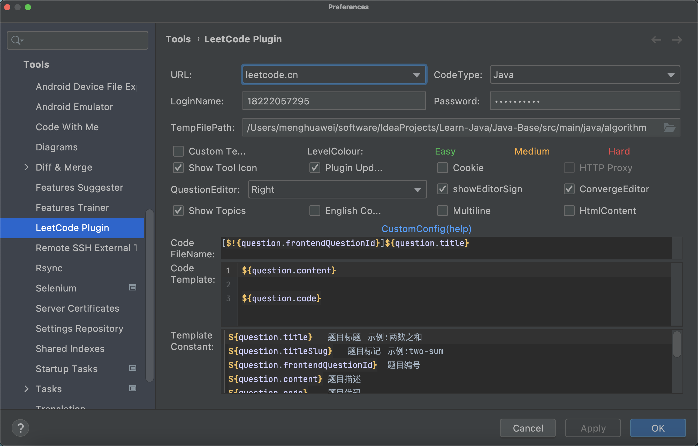
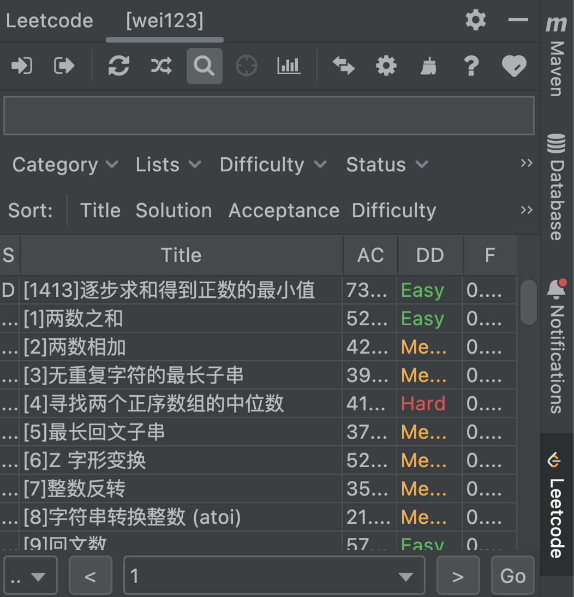

[TOC]

<h1 align="center">LeetCode</h1>

> By：weimenghua
> Date：2022.11.20
> Description：

### 一、LeetCode
- [LeetCode官网](https://leetcode.cn/)
- [LeetCode题解](https://doocs.gitee.io/leetcode/#/solution/0000-0099/0001.Two%20Sum/README)
- [LeetCode题解(github)](https://github.com/doocs/leetcode/tree/main/solution)

### 二、环境搭建
1、在IDEA的Plugins搜索LeetCode进行安装

2、点击LeetCode菜单设置，填写账号、密码一以及目录

3、点击LeetCode图标看到题目

