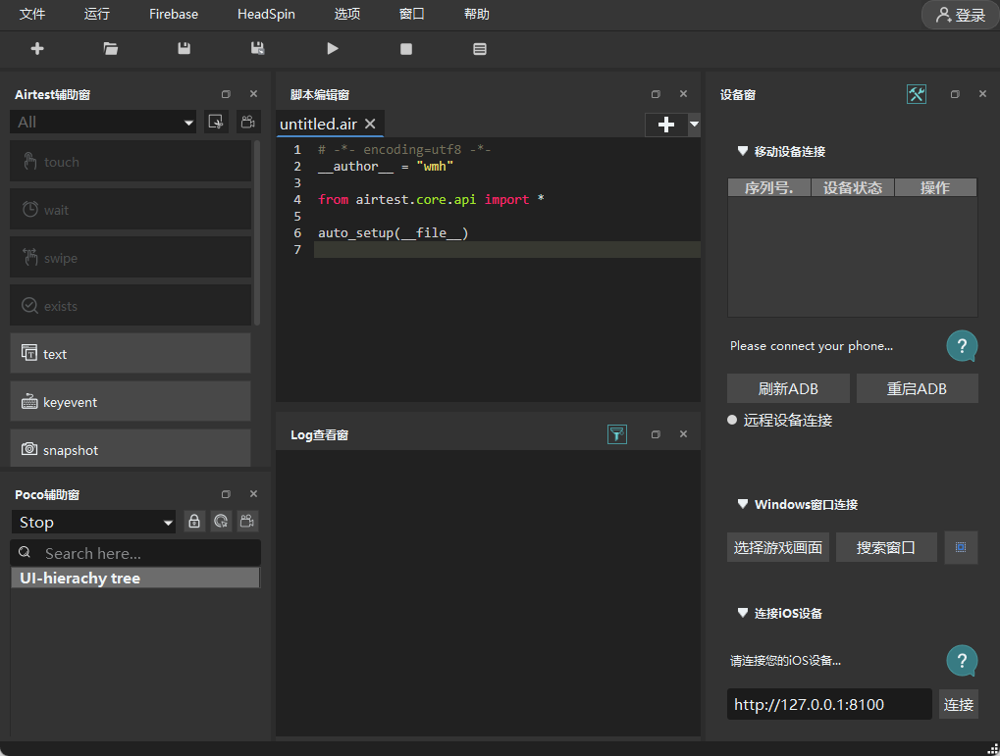
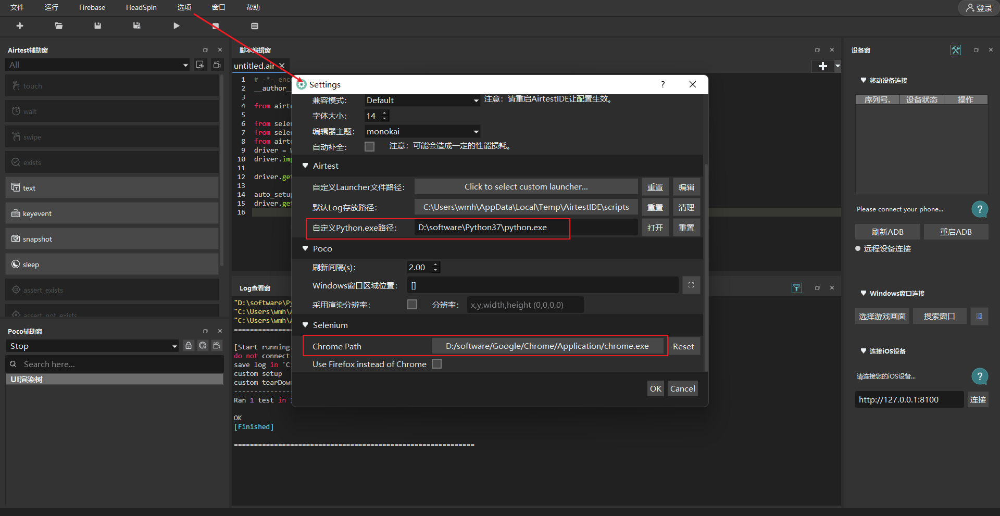

[TOC]

<h1 align="center">Airtest UI 自动化测试框架</h1>

> By：weimenghua
> Date：2023.06.05
> Description：

**参考资料**  
[Airtest官网](https://airtest.netease.com)  
[Airtest文档](https://airtest.doc.io.netease.com)  

### 一、Airtest 简介
Airtest框架：Airtest 是一个跨平台的、 基于图像识别 的UI自动化测试框架，适用于游戏和App，支持平台有Windows、Android和iOS。
Poco框架：Poco 是一款 基于UI控件识别 的自动化测试框架，目前支持Android原生、iOS原生、Unity3D、cocos2dx、UE4和Egret等平台，也可以在其他引擎中自行接入poco-sdk来使用。  
 

### 二、Airtest 环境搭建
AirtestIDE 是一款跨平台的 UI自动化测试编辑器 ，内置了Airtest和Poco的相关插件功能，能够使用它快速简单地编写 Airtest 和 Poco 代码。  
在官网下载AirtestIDE安装包后解压，双击到 AirtestIDE 路径下点击“AirtestIDE.exe”即可启动 AirtestIDE。
安装依赖：
- pip install airtest  
- pip install airtest_selenium  
- pip install opencv-python  
- pip install opencv-contrib-python  
- pip install pynput  

1. AirtestIDE主页面

2. AirtestIDE设置Python路径和Chrome路径：选项 > 设置

3. 显示 selenium 相关的操作控制按钮：窗口 > Selenium Window  

### 三、Airtest教程
运行：airtest run demo.py
