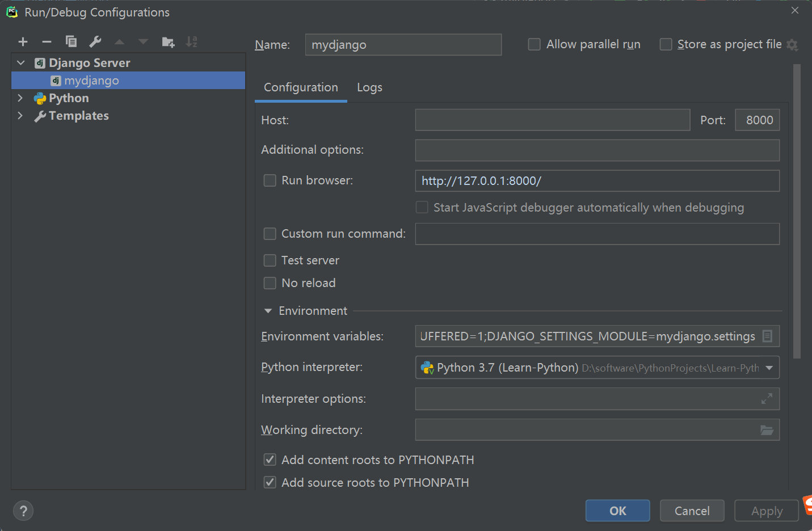

[TOC]

<h1 align="">Django Web 应用程序框架</h1>

> By：weimenghua
> Date：2022.07.10
> Description：


### 一、环境搭建
1、安装django
```
pip3 install Django -i https://pypi.tuna.tsinghua.edu.cn/simple

检查是否成功安装Django，在cmd输入：
python
import django
django.get_version()
查看到Django的版本号即说明Django安装成功   
```

2、创建项目
进入cmd执行：django-admin startproject mydjango(自定义名称)，  
把mydjango添加到setting.py的INSTALLED_APPS里。

3、启动项目
进入项目manage.py目录执行：python manage.py runserver 127.0.0.1:8000

4、访问项目 
http://127.0.0.1:8000
http://127.0.0.1:8000/admin
http://127.0.0.1:8000/hello

5、PyCharm启动项目
点击Edit Configurations > + Django Server
Run browser：http://127.0.0.1:8000/
Enviroments variables：PYTHONUNBUFFERED=1;DJANGO_SETTINGS_MODULE=mydjango.settings




### 二、Django目录结构说明
1. mydjango: 项目的容器。
2. manage.py: 一个实用的命令行工具，可让你以各种方式与该 Django 项目进行交互。
3. mydjango/__init__.py: 一个空文件，告诉 Python 该目录是一个 Python 包。
4. mydjango/asgi.py: 一个 ASGI 兼容的 Web 服务器的入口，以便运行你的项目。
5. mydjango/settings.py: 该 Django 项目的设置/配置。
6. mydjango/urls.py: 该 Django 项目的 URL 声明; 一份由 Django 驱动的网站"目录"。
7. mydjango/wsgi.py: 一个 WSGI 兼容的 Web 服务器的入口，以便运行你的项目。

#### 详细说明
##### urls.py 路由分发(include)  
存在问题：Django 项目里多个app目录共用一个 urls 容易造成混淆，后期维护也不方便。  
解决：使用路由分发（include），让每个app目录都单独拥有自己的 urls。  
步骤：  
1、在每个 app 目录里都创建一个 urls.py 文件。  
2、在项目名称目录下的 urls 文件里，统一将路径分发给各个 app 目录。 
```
from django.conf.urls import url
from django.contrib import admin
from django.urls import path
from . import views

urlpatterns = [
    path('admin/', admin.site.urls),
    url(r'^$', admin.site.urls),
    url('hello/', views.hello)
]
```

##### wsgi.py
WSGI 介绍：Python Web Server Gateway Interface，翻译过来时Python web服务器网关接口，实际上就是一种协议，我们的应用(Django，Flask)实现了WSGI，就可以配合实现了WSGI(uWSGI,gunicorn)的服务器工作了。  
WSGI三级结构：这种结构里，uWSGI作为中间件，它用到了uwsgi协议(与nginx通信)，wsgi协议(调用Flask app)。当有客户端发来请求，nginx先做处理(静态资源是nginx的强项)，无法处理的请求(uWSGI)，最后的相应也是nginx回复给客户端的。  
```
wsgi.py

import os
from django.core.wsgi import get_wsgi_application

os.environ.setdefault('DJANGO_SETTINGS_MODULE', 'mydjango.settings')

application = get_wsgi_application()
```

##### 静态资源访问
Django中，静态资源的存放通过设置 STATIC_URL, STATICFILES_DIRS 来设置，一般STATIC_URL设置为：/static/，STATIC_URL=’/static/’, 这个static 是在Django 具体APP下建立的static目录，用来存放静态资源。
而STATICFILES_DIRS一般用来设置通用的静态资源，对应的目录不放在APP下，而是放在Project下，例如：STATICFILES_DIRS=（os.path.join(BASE_DIR, “common_static”),）具体在模板文件中访问的时候，都是统一用：/static/资源名的方式，就可以访问到资源，不论具体的目录是APP下的static，还是project下的common_static, 都可以用/static/资源名的方式访问到。
```
settings.py

STATIC_URL = '/static/'

STATICFILES_DIRS = (
    os.path.join(BASE_DIR, 'static'),
)
```


### 三、数据库变更
1. 在settings.py的INSTALLED_APPS添加：'apps',和'mydjango',
2. 在settings.py引入pymysql
```
pymysql.version_info = (1, 4, 13, "final", 0)
pymysql.install_as_MySQLdb()
```
3. 在settings.py的DATABASES添加数据库配置
4. 通过命令来迁移到数据库，让Django模型有一些变更
```
python manage.py makemigrations    
python manage.py makemigrations mydjango
```
5. 创建表结构,将映射文件传入数据库 
python manage.py migrate
